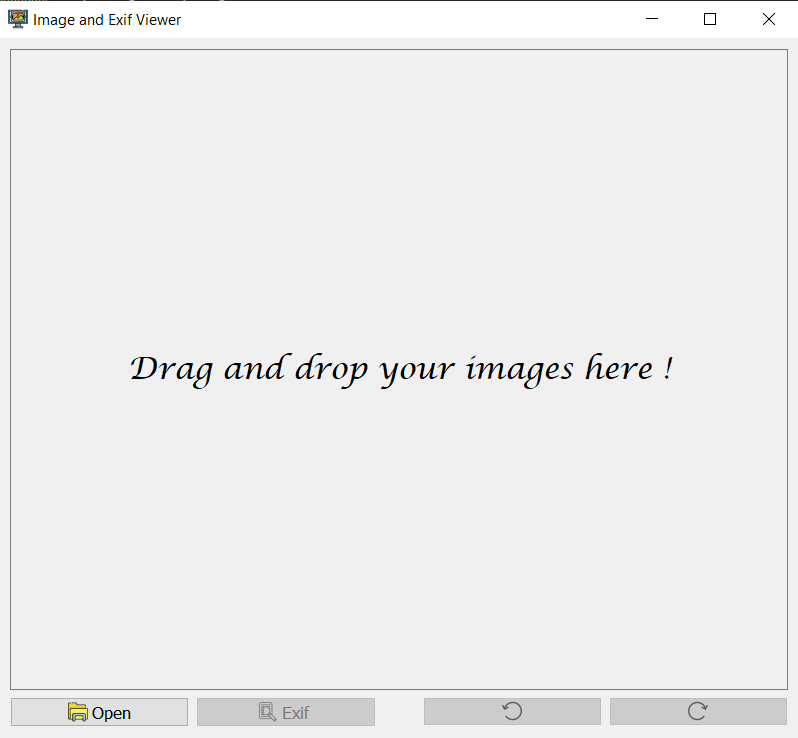
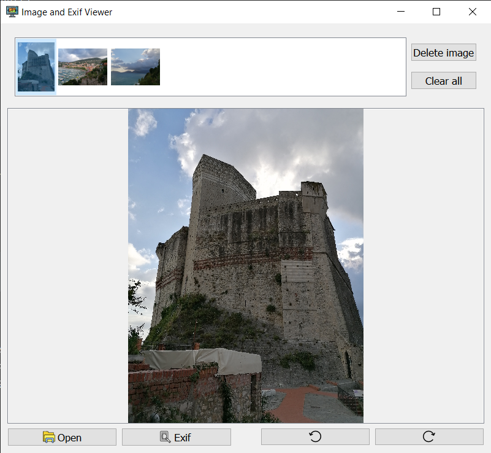
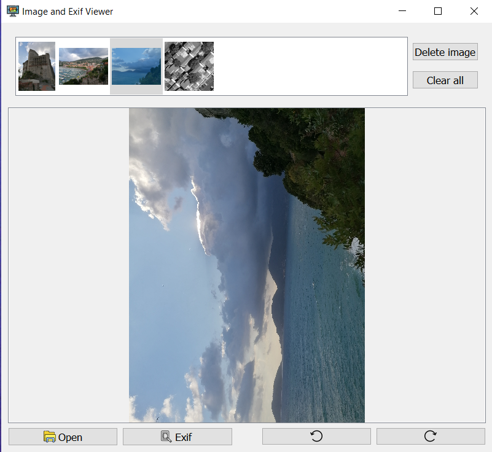
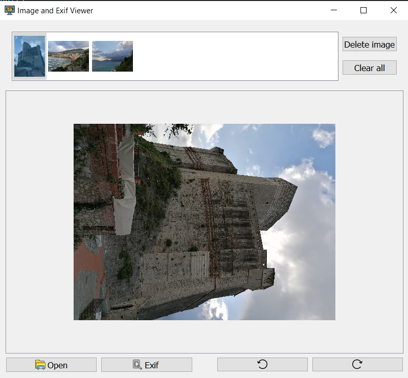
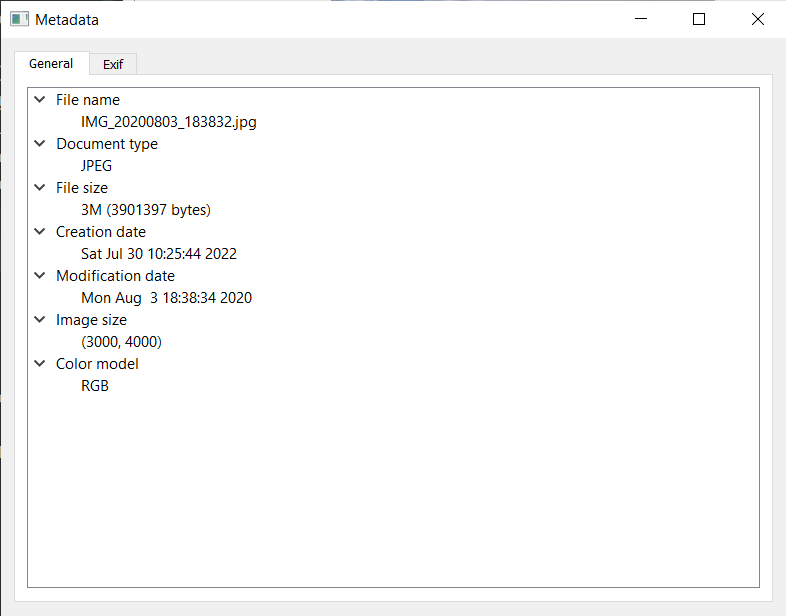
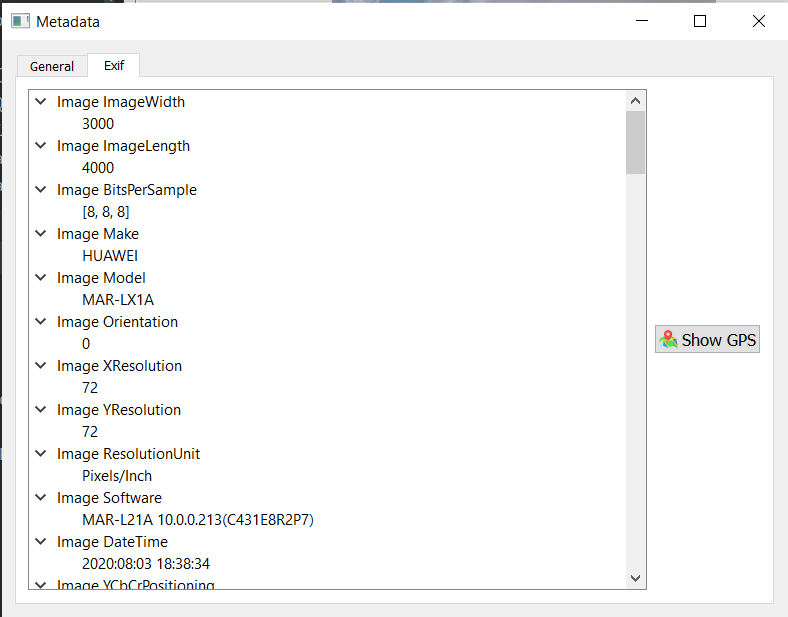
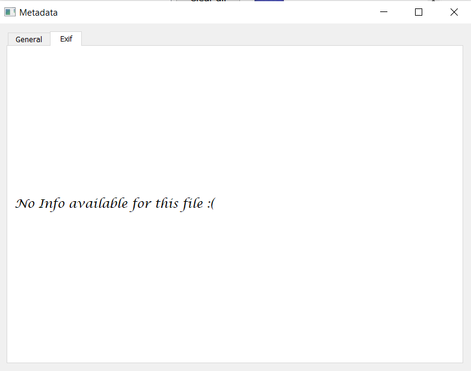

# Exif Viewer
A simple Image and Exif Viewer implemented in PyQt5 and Qt Designer. The implementation follows the Model View Controller (MVC) design pattern. In this context Qt Designer has been useful in order to better separate the Views from the Controllers. 

## Environment and packages

In the following paragraph some steps to recreate a usable environment are explained. Conda and Pip package manager with Python 3.9 have been used. 

- A usable conda environment can be directly created from the requirements_conda.txt file, using the command:
    
    ``` conda create --name <env> --file requirements_conda.txt ```

    The requirements_conda.txt file has been exported from an environment on Windows OS, so probably some packages don't correctly fit with different OS. A new conda environment can of course be created, with these commands:

    ```
    conda create --name hci python=3.9
    conda activate hci
    conda install pyqt5 ipython pyqt 
    pip install Pillow
    pip install ExifRead
    pip install hurry.filesize
    ```
    Pillow and ExifRead packages can also be installed with:
     ```
    conda install -c conda-forge exifread
    conda install -c anaconda pillow
    ```

## Usage

After the set up of the environment is completed, you can open a terminal window in the project directory downloaded and run the following command:

 ```
    python main.py
 ```

## Files
The main files are:
- main.py: it contains the application logic and the MainWindow class.
- model.py: it contains the Model of the data for the application
- custom_widgets.py: it contains additional widgets 

The other .py files inside the folder are the output files generated from the .ui files (contained in ui_files folder) through the command ``` pyuic5 -x -o name_file.py name_file.ui ```.

## Features

The following features have been implemented:

* **Image visualization**: the user can open JPEG and PNG images, one at a time. Support for **multiple image** visualization is added, through the presence of a List Widget. Switch among the images can be performed using arrow keys.

* **Image rescaling**: when the user
resizes the application, the user interface and the image scale appropriately, considering a maximum dimension (height or width) of 512 pixels.

* **Image rotation**: the user can rotate the selected image clockwise and counterclockwise, with 90 degrees increments.

* **Exif visualization**: if the image contains Exif metadata the application will show them in a separate view.

* **Geolocalization**: if GPS tags are present in the image, the user can click on an appropriate button and will be redirected to the location page on Google Maps.

* **Hotkeys**: some keyboard shortcuts have been inserted. In particular 
	+ ```Ctrl+O``` for Open an image
	+ ```Ctrl+L``` for Left rotation
	+ ```Ctrl+R``` for Right rotation
	+ ```Ctrl+E``` for Exif visualization

As an addictional feature **Drag and drop** functionalities have been added. The user can drag an image (a bounch of images) from a folder and drop it (them) in the application. 

## Screens of the interface

<div class="container d-flex align-items-start">
  <div class="row align-items-start">
  	<h4> Start view and single image view </h4>
  	
  	
  	<h4> Left and right rotations </h4>
  	
  	
  	<h4> General info, Exif and no Exif views </h4>
  	
  	
  	
    
  </div>
</div>

